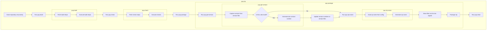

# Command flow

The following is the flow of sub commands that get executed when running `pup zip`.

```mermaid
flowchart TD
    clone[Clone repository recursively]
    build[Run pup build]
    buildFetch[Fetch build steps]
    buildLoop[Execute build steps]
    getVersion[Run pup get-version]
    captureVersion[Capture version from version files]
    isDev{Is this a dev build?}
    generateDevVersion[Generate dev version number]
    updateVersionNumbers[Update version numbers in version files]
    zipName[Run pup zip-name]
    fetchZipName[Grab zip name from config]
    generateZipName[Generate zip name]
    buildZipDir[Move files to dir to be zipped]
    checks[Run pup check]
    checkFetch[Fetch check steps]
    runChecks[Execute checks]
    package[Run pup package]
    packageZip[Package zip]
    clean[Run pup clean]
    
    
    subgraph pup zip
        clone --> build
        build --> buildFetch
        
        subgraph pup build
            buildFetch --> buildLoop
        end
        
        buildLoop --> checks
        checks --> checkFetch
        
        subgraph pup check
            checkFetch --> runChecks
        end
        
        runChecks --> package
        package --> getVersion

        subgraph pup package
            getVersion --> captureVersion
            
            subgraph pup get-version
                
                captureVersion --> isDev
                isDev --> |Yes| generateDevVersion
            end
            generateDevVersion --> updateVersionNumbers
            isDev --> |No| zipName
            updateVersionNumbers --> zipName
            zipName --> fetchZipName
            subgraph pup zip-name
                fetchZipName --> generateZipName
            end
            
            generateZipName --> buildZipDir
            buildZipDir --> packageZip
            
        end

        packageZip --> clean
    end
```