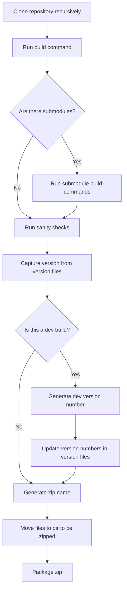

# Command flow

```mermaid
flowchart TD
    clone[Clone repository recursively]
    build[Run build command]
    hasSubmodules{Are there submodules?}
    submoduleBuild[Run submodule build commands]
    captureVersion[Capture version from version files]
    isDev{Is this a dev build?}
    generateDevVersion[Generate dev version number]
    updateVersionNumbers[Update version numbers in version files]
    generateZipName[Generate zip name]
    buildZipDir[Move files to dir to be zipped]
    runChecks[Run sanity checks]
    packageZip[Package zip]
    
    clone --> build
    build --> hasSubmodules
    hasSubmodules --> |Yes| submoduleBuild
    hasSubmodules --> |No| runChecks
    submoduleBuild --> runChecks
    runChecks --> captureVersion
    captureVersion --> isDev
    isDev --> |Yes| generateDevVersion
    isDev --> |No| generateZipName
    generateDevVersion --> updateVersionNumbers
    updateVersionNumbers --> generateZipName
    generateZipName --> buildZipDir
    buildZipDir --> packageZip
```